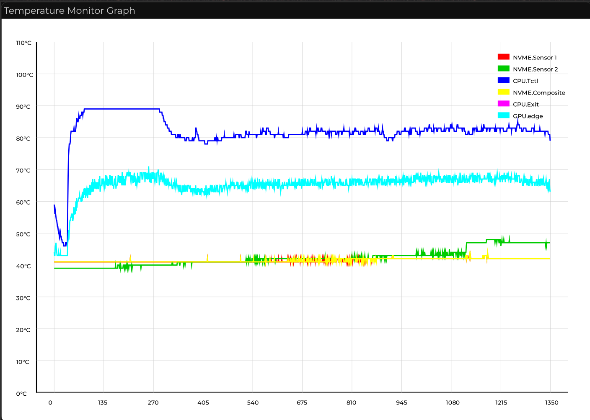

# How does it works?

- Twatch currently works by capturing HWMON devices using Rust + GTK4.


# What it can do right now?

    Current options are:

    -bt  | --by-temperature
    -bl  | --by-capture-limit
    -pl  | --plot-latest
    -ss  | --see-session

    -it  | --initial-temperature
    -et  | --end-temperature

    -mtg | --max-temperature-on-graph
    -ts  | --temperature-steps


    -d   | --delay
    -c   | --captures

    -ct  | --current-temperature
    -h   | --help

# Graphic Examples:

#

Firstly:

- Making session selector (Currently there are the session printer, easy tho)


Secondary:

- Hybrid POSIX flags
- Making show-hidden-posix (smth in line 70 or whatever)
- Creating a selection list for sessions [0%]
- Power usage monitor
- More detailed graphs
- extensive selection for devices

# How can I run it?

Currently, the project is based on Nix, which you can have a temporary shell with this command:

```nix shell github:rPlakama/Twatch```

# If I want to Colaborate?

In case that you want to help this project (Which sucks) feels free, I would be glad! Make a fork and create an pull request.
