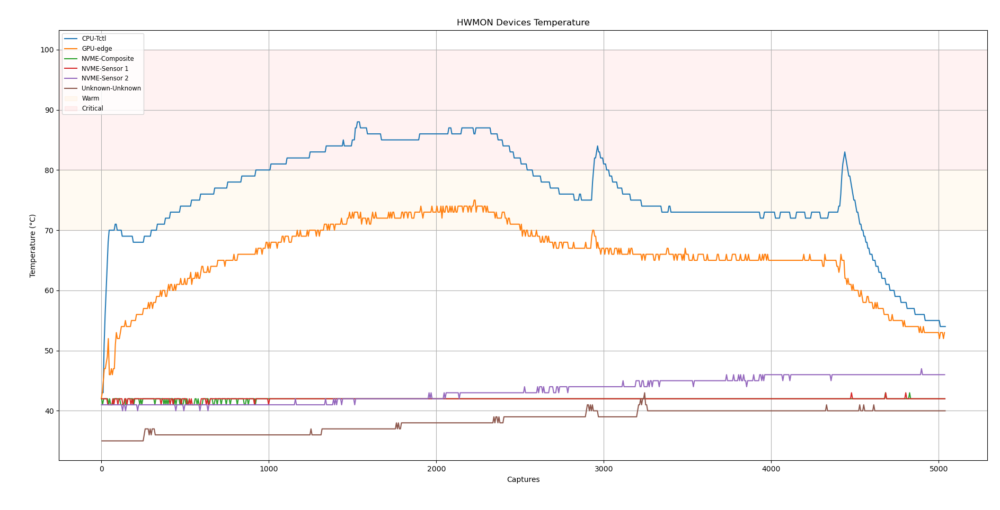

# How does it works? 

- Twatch currently works by capturing HWMON devices using Rust and creates a file, which Python does create an plot.

# Graphic Examples:

# 
# 
# 

TODO:

- Making the prints cleaner 
- Creating a selection list for sessions

- Making session debugger only spawn in session request
- Alr alr 
Secondary:

- Watts monitor
- Power usage monitor
- More detailed graphs
- extensive selection for devices
