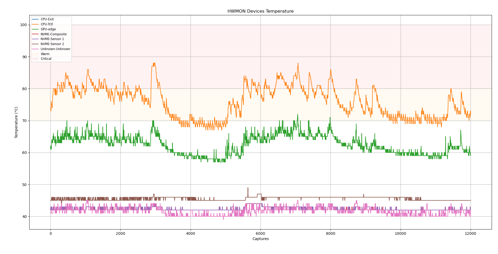
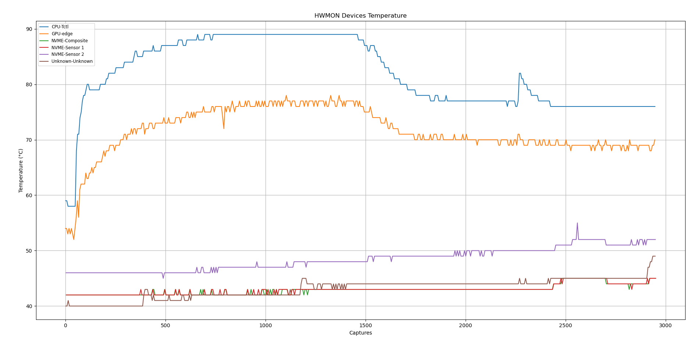

# How does it works? 

- Twatch currently works by capturing HWMON devices using Rust and creates a file, which Python does create an plot.


# Graphic Examples:

# 
# 


TODO:

- Making the prints cleaner [70%]
- Creating a selection list for sessions [0%]

Secondary:

- Watts monitor
- Power usage monitor
- More detailed graphs
- extensive selection for devices

# How can I run it? 

Currently, the project is based on Nix, which you can have a temporary shell with this command:

```nix shell github:rPlakama/Twatch``` 

But, since it uses small depedencies (pandas, and matplotlib). You can copy this repo with a mere clone. 


# If I want to Colaborate? 

In case that you want to help this project (Which sucks) feels free, I would be glad! Make a fork and create an pull request.
